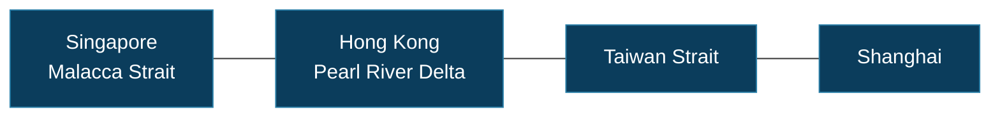
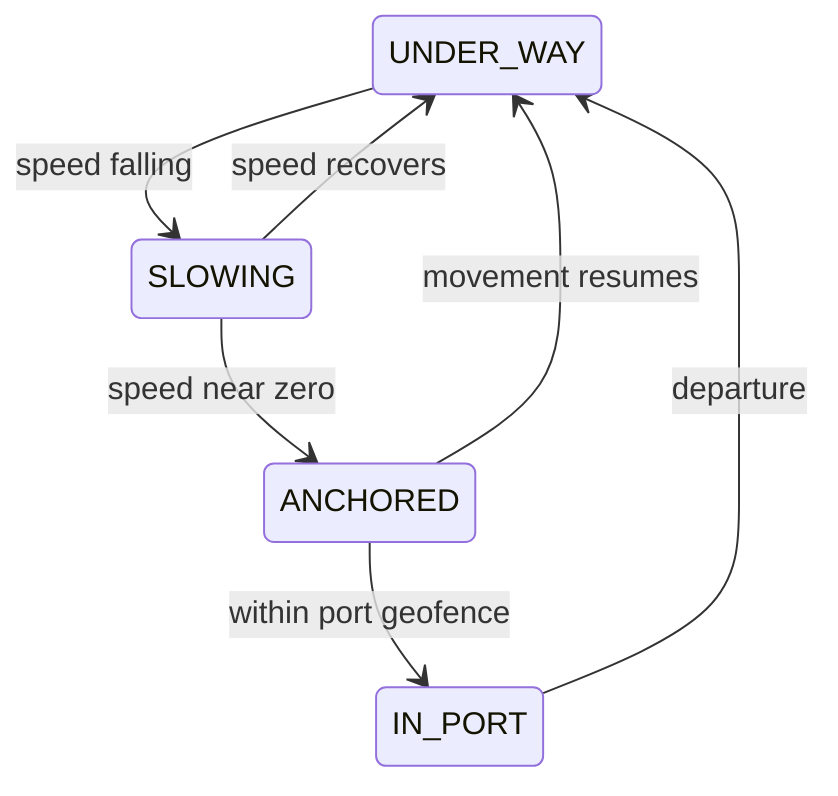
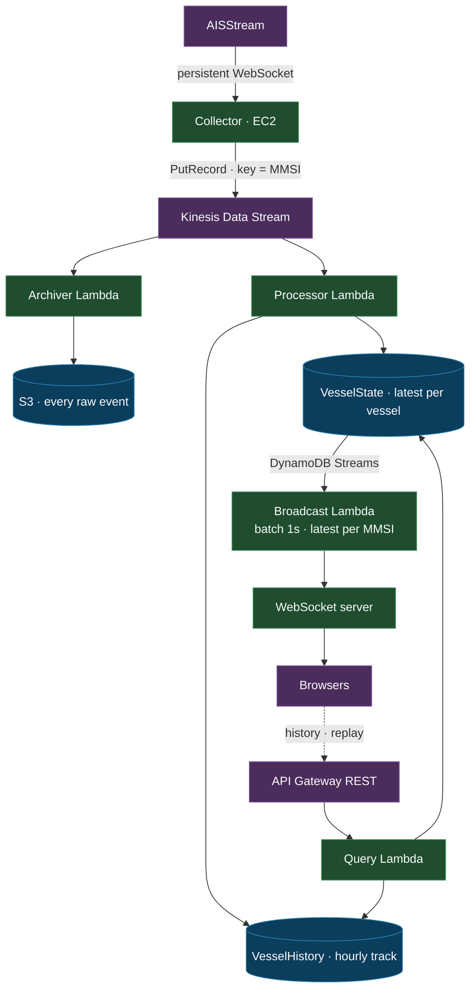

# Maritime Tracking

Real-time vessel tracking across the South China Sea — from Singapore and the
Malacca Strait, through Hong Kong and the Taiwan Strait, up to Shanghai.

Ships broadcast their position continuously over AIS radio. This platform
ingests that live feed, maintains the current state of every vessel in the
region, builds an hourly movement history, and serves both to a map you can
watch in real time or replay over any past day.



<sub>Bounding box · 0°–32°N, 99°–127°E</sub>

## What it does

**Live** — every vessel in the region on a map, moving as it moves. Click one
for its speed, course, heading and navigational status.

**History** — each vessel's track, sampled hourly, drawn over the map.

**Replay** — pick a vessel and a date, press play, and watch it retrace the
day's journey.

**State** — vessels are more than coordinates. Positions over time resolve into
behaviour, rendered as a timeline.



## Architecture



### The pieces

**Collector** — holds a persistent WebSocket to AISStream, translates each
message into the platform's own event shape, and forwards it to Kinesis. It
runs on EC2 rather than Lambda because the connection is long-lived: a process
that must stay connected needs a host that stays running. Reconnects with
exponential backoff and jitter.

**Kinesis** — the streaming backbone, and the seam that decouples ingestion from
everything downstream. Partitioned by MMSI, the vessel's unique identifier, so
each ship's messages stay ordered relative to one another.

**Processor Lambda** — consumes the stream, derives movement from consecutive
positions, and writes current state and hourly history.

**Archiver Lambda** — writes every raw event to S3 under
`raw/YYYY/MM/DD/hour=HH/`. Cheap, complete, and never read by the application.

**DynamoDB** — two shapes for two access patterns. `VesselState` keyed by MMSI
holds the latest position of every vessel and powers the live map.
`VesselHistory`, keyed by MMSI and timestamp, holds hourly snapshots and powers
replay.

**Broadcast Lambda** — watches `VesselState` via DynamoDB Streams, collapses
each batch to the latest state per vessel, and pushes one update per second to
the WebSocket server. Ships report far more often than a map needs to redraw.

**API Gateway** — REST endpoints for historical queries: vessel lists, detail,
tracks, and replay data.

### Storage tiers

Three tiers, each with one job:

| | Holds | Serves |
|---|---|---|
| **S3** | Every raw message, forever | Nothing — archive and rebuild source |
| **VesselHistory** | One position per vessel per hour | Replay and route drawing |
| **VesselState** | Latest position per vessel | The live map |

The rule throughout: **ingest everything, archive everything, process what's
needed, broadcast only what the UI needs.**

## Stack

| | |
|---|---|
| Ingestion | Node.js · TypeScript · WebSocket |
| Streaming | Amazon Kinesis Data Streams |
| Processing | AWS Lambda |
| Storage | DynamoDB · S3 |
| API | API Gateway · WebSocket |
| Frontend | Next.js · TypeScript · MapLibre GL |
| Infrastructure | Terraform |
| Local environment | LocalStack |

## Getting started

Requires Docker, Node.js and Terraform, plus a free API key from
[aisstream.io](https://aisstream.io).

```bash
cp .env.example .env              # add your AISStream key
cp terraform/.env.example terraform/.env

cd terraform && docker compose up -d
curl http://localhost:4566/_localstack/health

cd ../collector && npm install && npm run dev
```

Vessel positions begin printing immediately.

## Repository layout

```
collector/            AIS ingestion service
terraform/            Infrastructure, layered per environment
  environments/       Deployments — network · data · application
  modules/            Reusable infrastructure
```

Infrastructure is split into three layers per environment — `network`, `data`
and `application` — applied independently so a change to the application cannot
disturb the data that outlives it.
