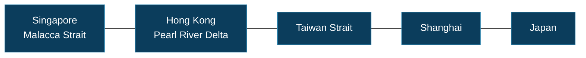
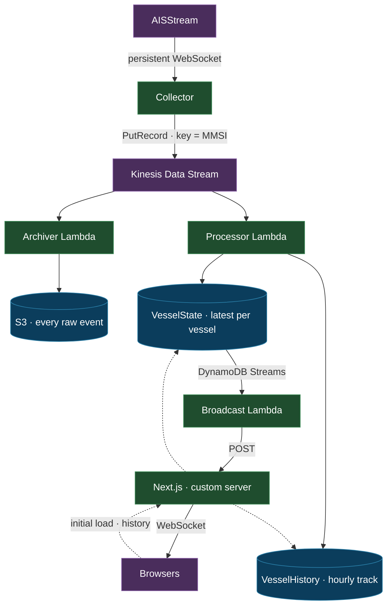

# Maritime Tracking

**[maritime.vowix.co/map](https://maritime.vowix.co/map)**

Real-time vessel tracking across East and Southeast Asia — from Singapore and
the Malacca Strait, through Hong Kong and the Taiwan Strait, up past Shanghai
to Japan.

Ships broadcast their position continuously over AIS radio. This platform
ingests that live feed, maintains the current state of every vessel in the
region, builds an hourly movement history, and pushes updates to a map as they
arrive.



<sub>Bounding box · 0°–46°N, 99°–146°E</sub>

## What it does

**Live map** — every vessel in the region, updating as positions arrive over a
WebSocket. Green for under way, red for stopped or anchored.

**Vessel detail** — click a dot for speed, course, heading, navigational status
and position.

**History** — each vessel's track, sampled hourly, drawn over the map when
selected.

**Live feed** — a running list of incoming broadcast batches, alongside a
roster of every vessel on record.

## Architecture



### The pieces

**Collector** — holds a persistent WebSocket to AISStream, translates each
message into the platform's own event shape, and forwards it to Kinesis. It
runs as a long-lived process rather than a Lambda because the connection must
stay open. Reconnects with exponential backoff and jitter.

**Kinesis** — the streaming backbone, and the seam that decouples ingestion
from everything downstream. Partitioned by MMSI, the vessel's unique
identifier, so each ship's messages stay ordered relative to one another. Two
independent consumers read it, each with its own checkpoint.

**Processor Lambda** — consumes the stream and writes both DynamoDB tables.
Each write is conditional, so correctness does not depend on delivery order:

- `VesselState` accepts a position only if its timestamp is newer than the
  stored one, so a replayed or out-of-order record can never overwrite a
  fresher position.
- `VesselHistory` accepts a position only if that vessel has no row for that
  hour yet. The first report of each hour wins; the rest are rejected. That is
  what makes the history hourly rather than a copy of the raw feed.

**Archiver Lambda** — writes every raw event to S3 under
`year=YYYY/month=MM/day=DD/hour=HH/<sequenceNumber>.json`. Hive-style
partitioning, so a query engine can read one hour without scanning the bucket.
The sequence number as filename guarantees two events in the same second cannot
collide.

**Broadcast Lambda** — watches `VesselState` via DynamoDB Streams and POSTs
each batch of changes to the Next.js server, which fans them out over
WebSocket. Failures are logged rather than thrown: a missed live update is not
worth stalling the stream, since the data is already safely in DynamoDB.

**Next.js** — runs behind a custom Node server so the WebSocket server can
share its port. Serves the map, queries DynamoDB directly server-side for the
initial paint and for history, and receives the broadcast POSTs.

### Storage tiers

Three tiers, each with one job:

| | Holds | Retention | Serves |
|---|---|---|---|
| **S3** | Every raw message | 365 days | Archive — never read by the app |
| **VesselHistory** | One position per vessel per hour | 90 days (TTL) | Track drawing |
| **VesselState** | Latest position per vessel | Overwritten | The live map |

The rule throughout: **ingest everything, archive everything, process what's
needed, broadcast only what the UI needs.**

## Stack

| | |
|---|---|
| Ingestion | Node.js · TypeScript · WebSocket |
| Streaming | Amazon Kinesis Data Streams |
| Processing | AWS Lambda · Node 20 |
| Storage | DynamoDB · S3 |
| Frontend | Next.js · TypeScript · MapLibre GL |
| Realtime | `ws` on a Next.js custom server |
| Infrastructure | Terraform |
| AWS environment | LocalStack |

AWS services run on [LocalStack](https://localstack.cloud) rather than a real
account. The Terraform is written as it would be for AWS — the provider's
endpoint configuration is the only difference — which keeps the infrastructure
work honest without the bill. The one thing this cannot exercise is IAM, since
LocalStack does not enforce policies.

## Getting started

Requires Docker, Node.js and Terraform, plus a free API key from
[aisstream.io](https://aisstream.io).

```bash
cp .env.example .env                      # add your AISStream key
cp terraform/.env.example terraform/.env

# 1. AWS emulation
cd terraform && docker compose up -d
curl http://localhost:4566/_localstack/health

# 2. Lambda bundles — Terraform reads these at plan time
cd ../processor && npm install && npm run package
cd ../archiver  && npm install && npm run package
cd ../broadcast && npm install && npm run package

# 3. Infrastructure — data layer first, the application layer reads its state
cd ../terraform/environments/dev/data && terraform init && terraform apply
cd ../application                     && terraform init && terraform apply

# 4. Ingestion
cd ../../../../collector && npm install && npm run dev

# 5. Map
cd ../nextjs && npm install && npm run dev
```

The map is at `localhost:3901`. Vessels appear as soon as the collector
connects.

### Deploying changes to a Lambda

Terraform uploads the zip; it does not build it. After editing a handler:

```bash
cd processor && npm run package
cd ../terraform/environments/dev/application && terraform apply
```

Skip the first step and Terraform reports no changes, because `source_code_hash`
reads the file on disk.

## Repository layout

```
collector/            AIS ingestion — long-lived WebSocket to Kinesis
processor/            Kinesis → DynamoDB, both tables
archiver/             Kinesis → S3, raw events
broadcast/            DynamoDB Streams → Next.js webhook
nextjs/               Map, API routes, custom server with WebSocket
terraform/
  environments/dev/   data · application
  modules/            kinesis · dynamodb · s3 · lambda · iam
```

Infrastructure is split into layers applied independently, so a change to the
application cannot disturb the data that outlives it. The `data` layer exports
ARNs through its state file; `application` reads them via `terraform_remote_state`.

Modules hold no project-specific knowledge — `modules/dynamodb` does not know
what a vessel is, and `modules/lambda` is called three times with different
code and permissions. Everything specific to this system lives in
`environments/dev/`.

---

© 2026 Wilson Wong
